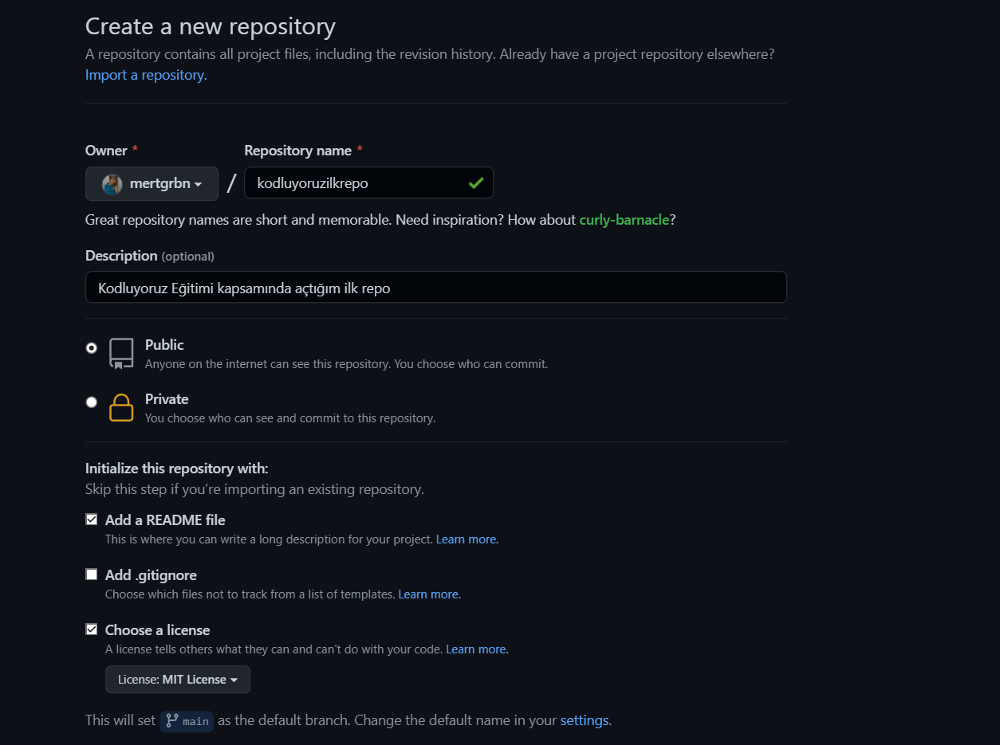

# Kodluyoruz İlk Repo

 Bu repo Kodluyoruz Front-End Eğitiminde oluşturduğumuz ilk repo. İçerisinde bir adet README dosyası, bir adet de index.html barındırıyor.



# Installation

Öncelikle projeyi clonelayın. (https://github.com/mertgrbn/kodluyoruzilkrepo)

`git clone (https://github.com/mertgrbn/kodluyoruzilkrepo!)`

# Usage
Projeyi cloneladıktan sonra Visual Studio Code programında açınız.

Linux için:

```cd kodluyoruzilkrepo ```

``` code . ```

# Contributing

Pull requestler kabul edilir. Büyük değişikler için, lütfen önce neyi değiştirmek istediğinizi tartışmak için bir konu açınız.

# License

[MIT](https://choosealicense.com/licenses/mit/)